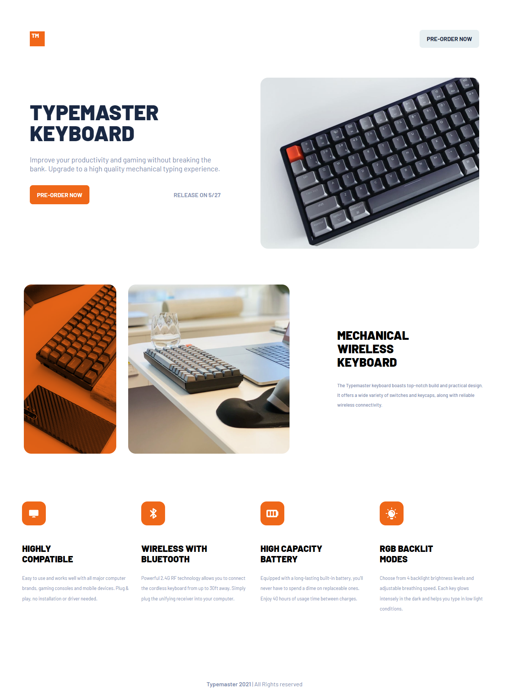

# Frontend Mentor - Typemaster pre-launch landing page solution

This is a solution to the [Typemaster pre-launch landing page challenge on Frontend Mentor](https://www.frontendmentor.io/challenges/typemaster-prelaunch-landing-page-J6-Yj5J-X). Frontend Mentor challenges help you improve your coding skills by building realistic projects.

## Table of contents

* [Overview](#overview)

  * [The challenge](#the-challenge)
  * [Screenshot](#screenshot)
  * [Links](#links)
* [My process](#my-process)

  * [Built with](#built-with)
  * [What I learned](#what-i-learned)
  * [Continued development](#continued-development)
  * [Useful resources](#useful-resources)
* [Author](#author)

## Overview

### The challenge

Users should be able to:

* View the optimal layout depending on their device's screen size
* See hover states for interactive elements

### Screenshot



### Links

* Solution URL: [https://github.com/sirrryasir/Typemaster-pre-launch-landing-page](https://github.com/sirrryasir/Typemaster-pre-launch-landing-page)

## My process

### Built with

* Semantic HTML5 markup
* CSS custom properties
* Flexbox
* CSS Grid
* Mobile-first workflow
* Git & GitHub for version control

### What I learned

While building this project, I learned how to:

* Set up a responsive layout for multiple screen sizes using media queries
* Create consistent spacing using utility CSS classes
* Use semantic HTML for better accessibility and structure
* Structure image assets across desktop, tablet, and mobile views without duplication

```html
<section class="feature">
  
</section>
```

```css
.feature {
  display: grid;
  gap: 2rem;
}
```

### Continued development

I want to keep improving in:

* CSS Grid mastery for complex layouts
* Accessibility best practices
* Project structure and scalability

### Useful resources

* [MDN Web Docs](https://developer.mozilla.org/) - For solid HTML/CSS references
* [Frontend Mentor](https://www.frontendmentor.io) - For practical challenges

## Author

* Portfolio - [Yasir Hassan](https://github.com/sirrryasiry)
* Frontend Mentor - [@sirrryasir](https://www.frontendmentor.io/profile/siryazy)
* Twitter - [Yasir Hassan](https://twitter.com/sirrryasir)

## Acknowledgments

Special thanks to the Frontend Mentor community and my mentor Ustaad Cabdimajiid Waaberi for their inspiration and guidance.
